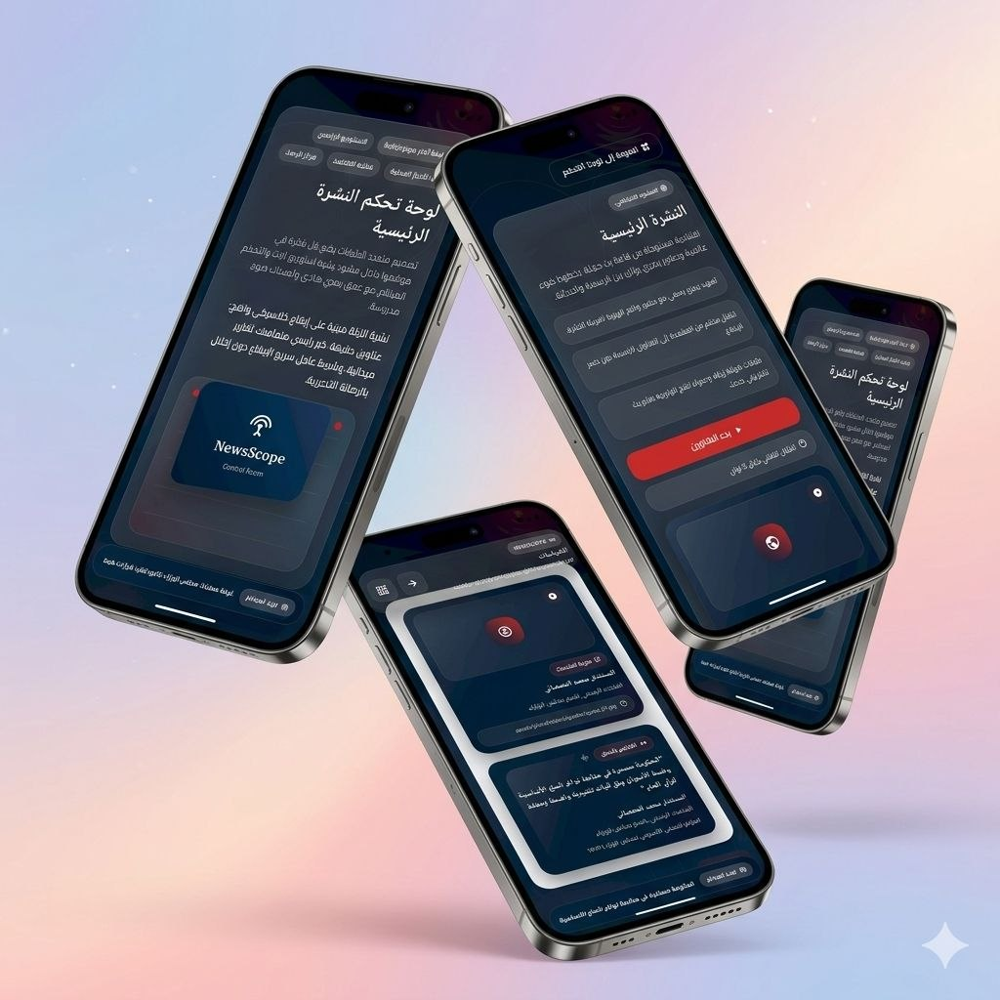
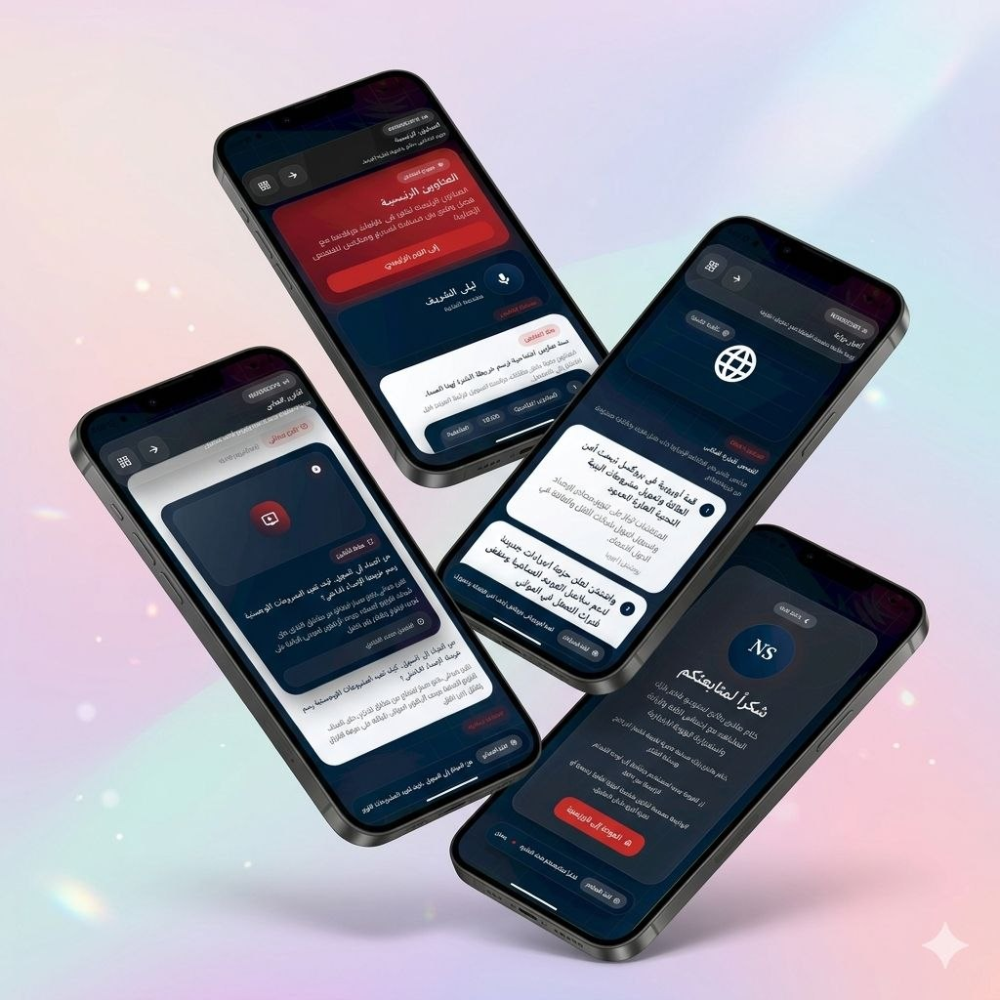

# NewsScope

  
  

A premium Arabic news application built with **Flutter** and **GetX**, designed with a formal classic newsroom identity and enhanced with modern 3D-inspired UI elements.

---

## 📰 Overview

NewsScope is a modular mobile news presentation app that simulates the structure of a professional TV news program. It includes multiple editorial sections such as headlines, main news, reports, economy, sports, weather, and breaking news, all presented through a responsive Flutter interface.

The project follows a **GetX-based architecture** with separated modules, bindings, controllers, routes, shared widgets, and theme layers to keep the codebase scalable and maintainable.

---

## ✨ Key Features

- Arabic-first user interface with RTL-friendly layout  
- Flutter + GetX architecture  
- Named routing with bindings for each screen  
- Reusable shared widgets  
- Professional classic news visual identity  
- 3D-inspired cards and layered UI presentation  
- Mock data support for rapid prototyping  
- Fully responsive layouts  

### 📺 Program Sections

- Splash  
- Home Dashboard  
- Intro  
- Headlines  
- Main News  
- Report  
- Quotes / Statements  
- Local News  
- Arab News  
- International News  
- Economy  
- Breaking News  
- Sports  
- Weather  
- Outro  

---

## 🛠 Tech Stack

- **Flutter**
- **Dart**
- **GetX**
  - State Management  
  - Routing  
  - Dependency Injection  

---

## 🧠 Architecture

The project follows a **feature-first modular architecture**:

- `views` → UI screens  
- `controllers` → state & logic  
- `bindings` → dependency injection  
- `widgets` → reusable components  
- `theme` → colors, typography, design tokens  
- `data` → models, mock data, repositories  

Each class is placed in a separate file to ensure scalability and maintainability.

---

## 🎨 UI / Design System

NewsScope is built to reflect a **professional TV newsroom experience**.

### Visual Identity

- 🎯 Dark navy blue + red + white palette  
- 🧾 Clean Arabic typography  
- 🧊 3D-inspired cards & layered panels  
- 📡 Broadcast-style headers & tickers  
- 🧩 Elevated content containers  

---

## 🗂 Available Sections

### 🔹 Splash
Opening screen with branding and logo animation.

### 🔹 Home
Central dashboard for navigation.

### 🔹 Intro
Broadcast-style program opening.

### 🔹 Headlines
Main bulletin headlines display.

### 🔹 Main News
Featured top story presentation.

### 🔹 Report
In-depth news analysis with media.

### 🔹 Quotes
Official statements and highlights.

### 🔹 Local News
Domestic and city-level updates.

### 🔹 Arab News
Regional Middle East coverage.

### 🔹 International News
Global developments and updates.

### 🔹 Economy
Markets, finance, and indicators.

### 🔹 Breaking News
Urgent real-time updates.

### 🔹 Sports
Match results and sports highlights.

### 🔹 Weather
Forecasts and alerts.

### 🔹 Outro
Closing scene of the program.

